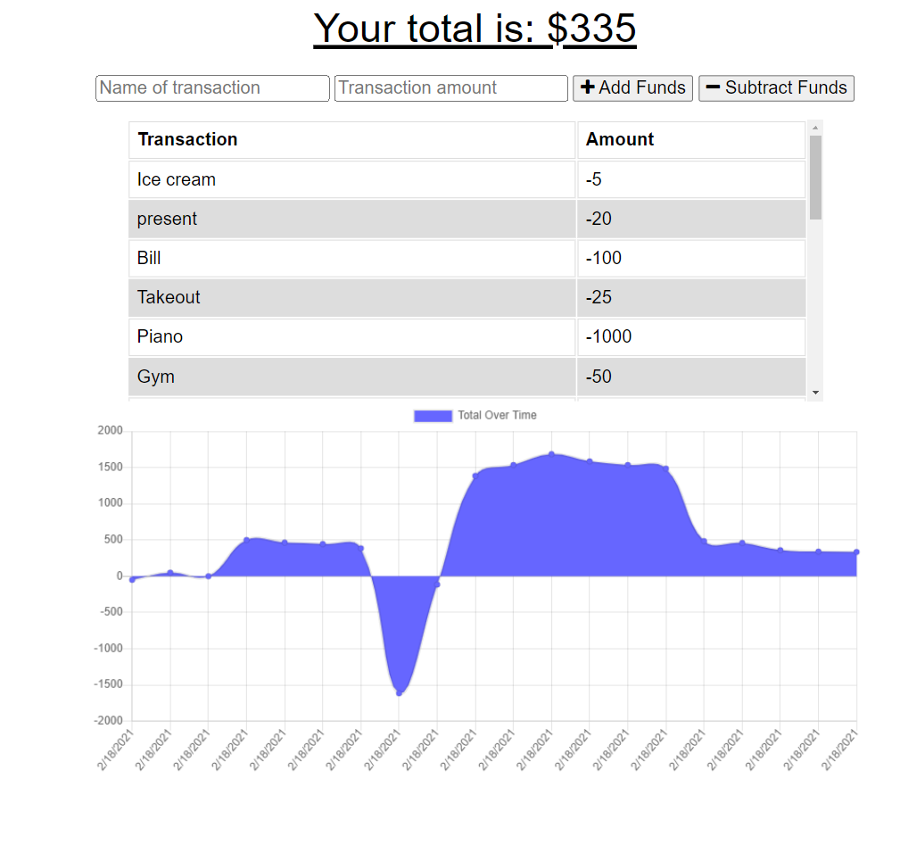
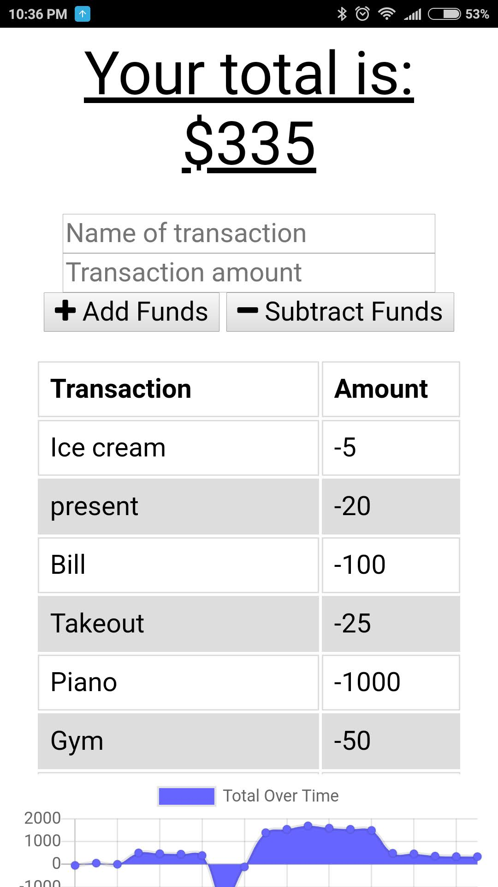

# Budget-Tracker-PWA

## Description
The Budget Tracker application allows users to enter and keep track of their budget online and offline. Provided with the frontend and backend code that works online only, the task at hand was to add the code to make the application PWA. This was done using IndexedDB, Web app manifest, and service worker. This application is deployed on Heroku using MongoAtlas as the online database.

* Link to the app on Heroku: https://fathomless-ocean-57959.herokuapp.com/
* Link to the Github repository: https://github.com/akwanmtl/Budget-Tracker-PWA

## Table of Contents

* [Usage](#usage)
* [Credits](#credits)
* [License](#license)

## Usage 

Here is a screenshot of the application:

To add a new transaction, enter the name of the transaction and the amount in the two input fields and press on either the Add Funds or Subtract Funds button depending on the transaction.

As a PWA application, the website can be added as an app on a mobile device. 

Here is a screenshot of the app icon on the home screen of a mobile device:
 

And here is a screenshot of the application run on a mobile device:
 

## Credits

* [License badge link](https://gist.github.com/lukas-h/2a5d00690736b4c3a7ba)

## License

Copyright (c) [2021] [Annie Kwan]
